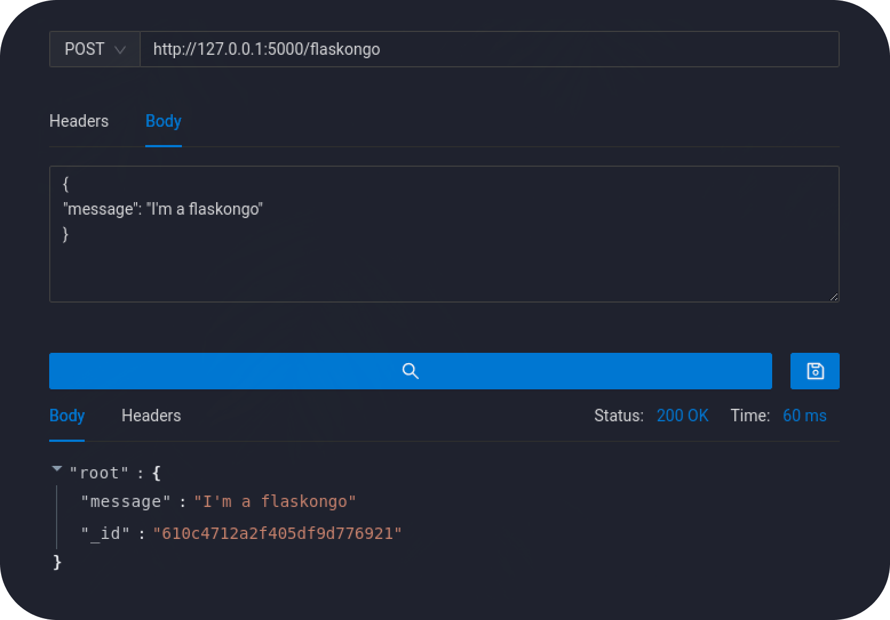
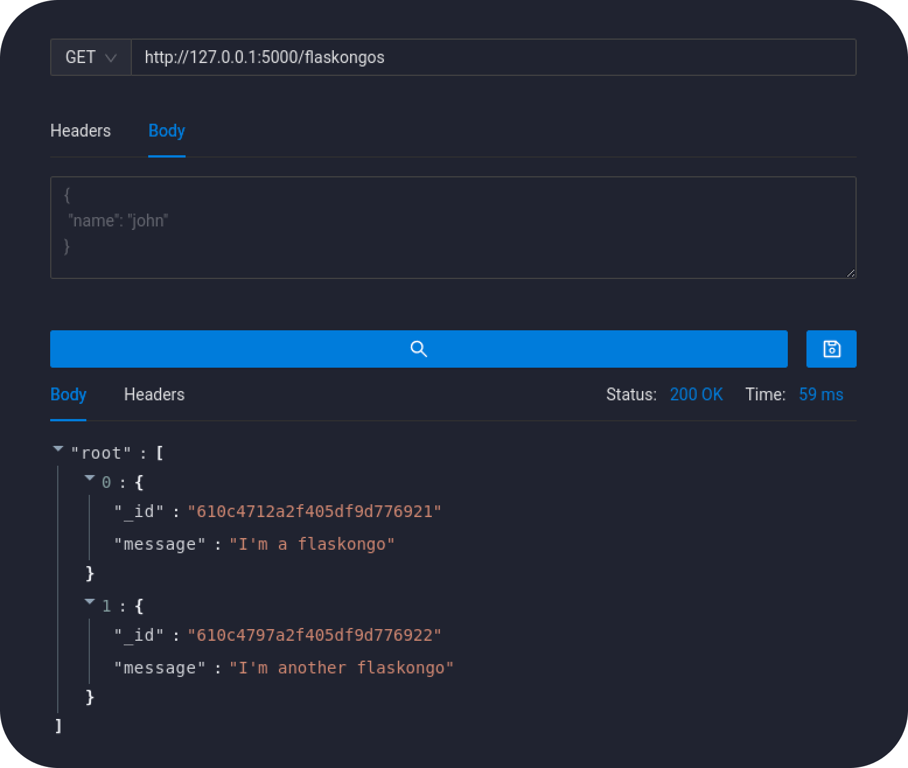
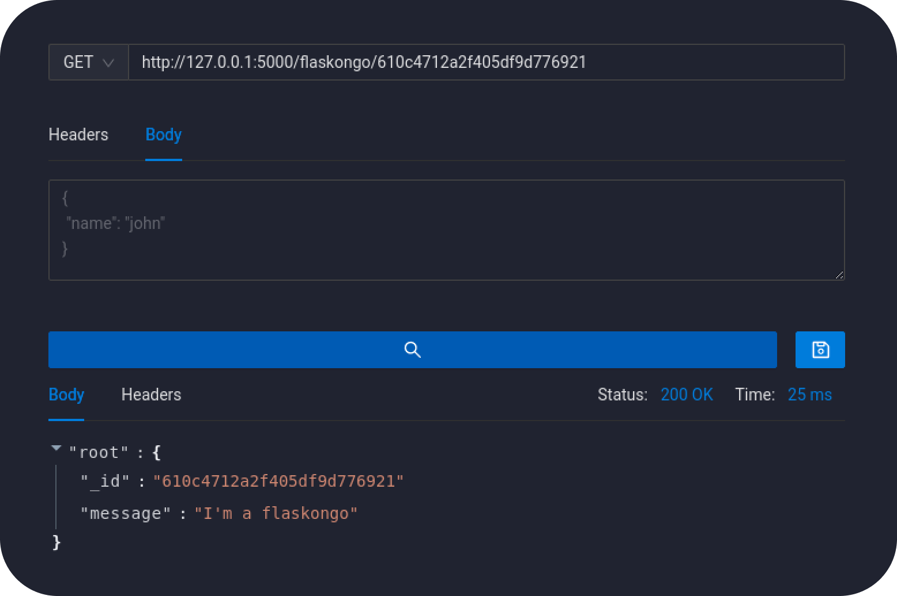
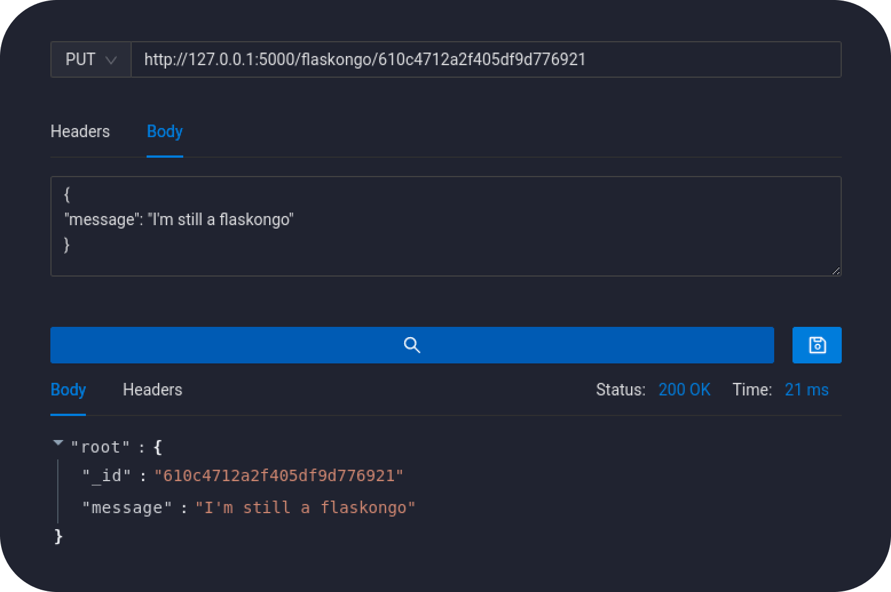
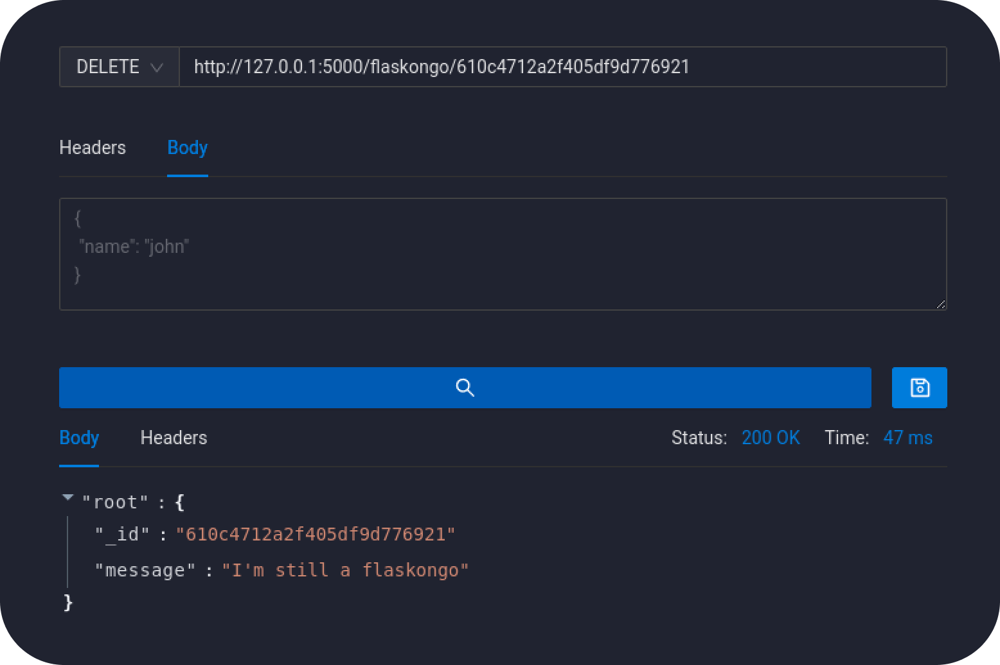

## Flaskongo, flaskongo! 🌶️🐍

Flask CRUD api using containerized mongoDB.

### Install dependencies
```bash
pip3 install -r requirements.txt
```
### And try it out!
```bash
docker-compose up -d
flask run
```
> Use 'docker-compose down' to stop the mongodb container

### Create
<p align="center" width="100%">
    
</p>

### Read

- Read All
<p align="center" width="100%">
    
</p>

- Read One
<p align="center" width="100%">
    
</p>

### Update
<p align="center" width="100%">
    
</p>

### Delete
<p align="center" width="100%">
    
</p>
